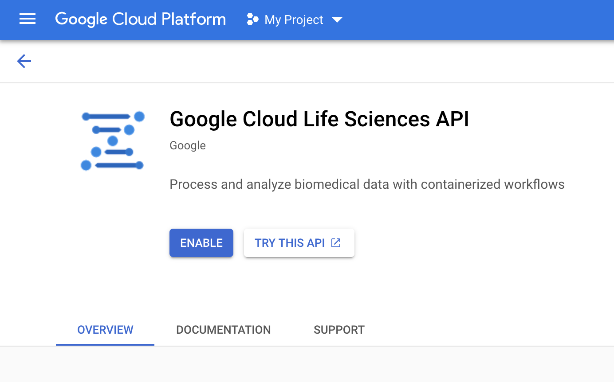

# Running Workflows via GMS


## Initial Setup

Enter docker container for this repo, `jackmaruska/cloudize-workflow:latest`


Enable requisite APIs in Google Cloud Platform. Easiest way to do this
is probably just to navigate to them in the web console. Follow each
link and you should see something like this Enable view:


- https://console.cloud.google.com/storage
- https://console.cloud.google.com/compute
- https://console.cloud.google.com/lifesciences/pipelines
- https://console.cloud.google.com/iam-admin


Create requisite resources. Any that already exist will spit out an
"already exists" stderr but these can be safely ignored. This creates
the required service accounts, bucket, and permissions.
```
sh /opt/gms/resources.sh --project PROJECT --bucket BUCKET
```

Add the values given from this script to your environment
configuration.

You should now be able to run a workflow on the cloud via your new
environment configuration.


## Who can use these resources?

Permissions required to run a GMS workflow are:
- create a compute instance
- read/write files to bucket
- use Cromwell server service account
  which enables using the Cromwell compute service account, and run
  lifesciences workflows

GMS should be enforcing these requirements on the running user,
meaning you have to be `gcloud auth`d to operate. This works for
manual workflow kickoffs but not for automated ingestion, which will
be tackled later.
